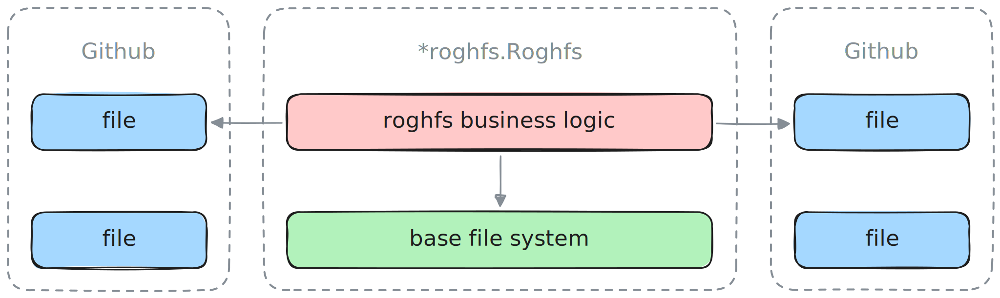

# roghfs

Roghfs stands for **R**ead-**O**nly **G**it**H**ub **F**ile **S**ystem. This is
an [afero.Fs] implementation allowing efficient reads for file content of remote
Github repositories. The provided Github auth token may allow for accessing
private repositories too. The original use case for this package came from
[Kayron], our release operator.



### Usage

[afero.Walk] takes a standard [filepath.WalkFunc], so that you can traverse any
Github repository as if it were located on your host machine. Note that this
file system implementation has been built with concurrency in mind, and basic
synchronization primitives are in place, though real concurrency under load has
not been tested at the time of writing. If you ever encounter any problems,
please create an issue or reach out otherwise.

```go
// https://github.com/0xSplits/kayron/commit/d2f2a18b998172039c6f2a325d4c83de20819e3e

gfs := roghfs.New(roghfs.Config{
	Bas: afero.NewMemMapFs(),
	Git: github.NewClient(nil).WithAuthToken("..."),
	Own: "0xSplits",
	Rep: "kayron",
	Ref: "d2f2a18b998172039c6f2a325d4c83de20819e3e",
})

err := afero.Walk(gfs, ".", func(pat string, fil fs.FileInfo, err error) error {
  return nil
})
```

### Development

All changes made need to comply with the `afero.Fs` interface first and
foremost. There is an integration test configured to run in CI, which provides a
pretty good indicator for whether the package works as expected. It should be
straight forward to abstract the current implementation further in order to
inject remote clients other than the current tightly coupled Github client, e.g.
Gitlab or Bitbucket etc.

```go
type Fs interface {
	// Create creates a file in the filesystem, returning the file and an
	// error, if any happens.
	Create(name string) (File, error)

	// Mkdir creates a directory in the filesystem, return an error if any
	// happens.
	Mkdir(name string, perm os.FileMode) error

	// MkdirAll creates a directory path and all parents that does not exist
	// yet.
	MkdirAll(path string, perm os.FileMode) error

	// Open opens a file, returning it or an error, if any happens.
	Open(name string) (File, error)

	// OpenFile opens a file using the given flags and the given mode.
	OpenFile(name string, flag int, perm os.FileMode) (File, error)

	// Remove removes a file identified by name, returning an error, if any
	// happens.
	Remove(name string) error

	// RemoveAll removes a directory path and any children it contains. It
	// does not fail if the path does not exist (return nil).
	RemoveAll(path string) error

	// Rename renames a file.
	Rename(oldname, newname string) error

	// Stat returns a FileInfo describing the named file, or an error, if any
	// happens.
	Stat(name string) (os.FileInfo, error)

	// The name of this FileSystem
	Name() string

	// Chmod changes the mode of the named file to mode.
	Chmod(name string, mode os.FileMode) error

	// Chown changes the uid and gid of the named file.
	Chown(name string, uid, gid int) error

	// Chtimes changes the access and modification times of the named file
	Chtimes(name string, atime time.Time, mtime time.Time) error
}
```

[afero.Fs]: https://github.com/spf13/afero
[afero.Walk]: https://pkg.go.dev/github.com/spf13/afero#Walk
[filepath.WalkFunc]: https://pkg.go.dev/path/filepath#WalkFunc
[Kayron]: https://github.com/0xSplits/kayron
